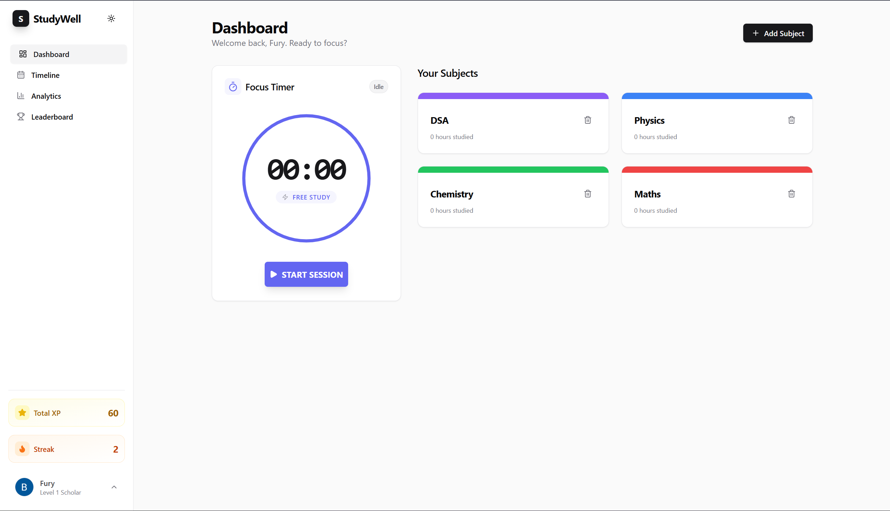
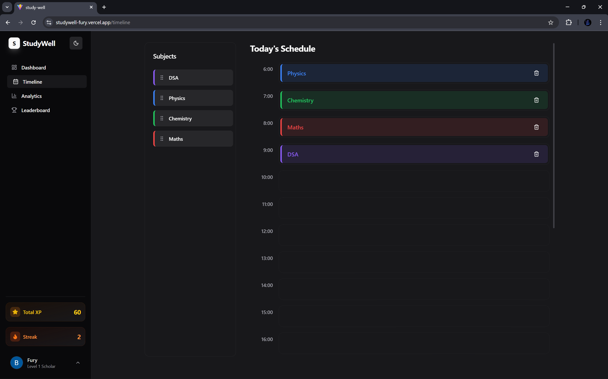
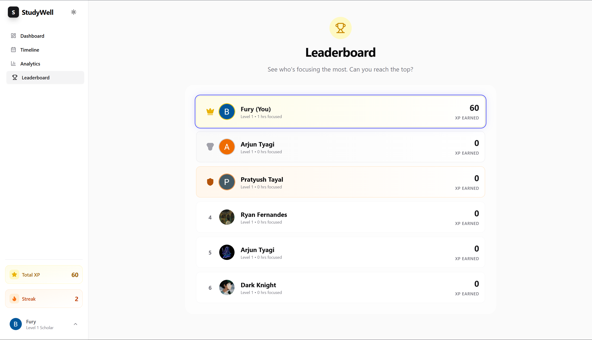
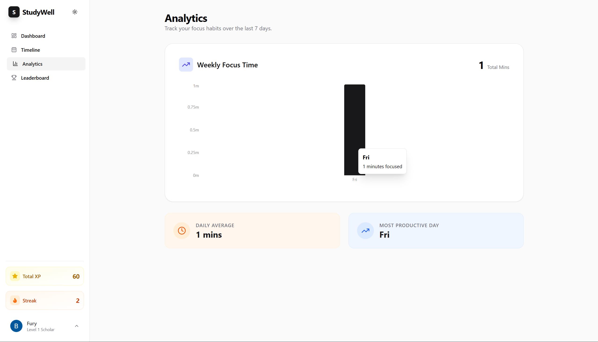

<div align="center">
  <br />
    <a href="https://studywell-fury.vercel.app" target="_blank">
      
    </a>
  <br />

  <h1>StudyWell</h1>

  <h3><strong>The Ultimate Aesthetic Study Ecosystem</strong></h3>

  <p>
    A gamified, intelligent productivity suite designed to turn academic chaos into structured success.
  </p>

  <p align="center">
    <a href="https://studywell-fury.vercel.app" target="_blank"><strong>View Live Demo »</strong></a>
    <br />
    <br />
    <a href="https://github.com/SilentFURY-x/StudyWell/issues">Report Bug</a>
    ·
    <a href="https://github.com/SilentFURY-x/StudyWell/pulls">Request Feature</a>
  </p>
</div>

<div align="center">


</div>

<br />

## ⚡ Overview

**StudyWell** isn't just a to-do list; it's a **smart assistant** for your academic life. Built to solve the problem of disorganized study schedules, it combines powerful planning tools with modern gamification to keep users addicted to productivity.

Featuring a **drag-and-drop timeline**, **real-time focus timer**, and a **competitive leaderboard**, StudyWell wraps complex functionality in a beautiful, glassmorphic UI that feels right at home on any modern device.

---

## 📸 Screenshots

| **The Command Center** | **Smart Timeline** |
|:---:|:---:|
|  |  |
| *Intuitive Dashboard with integrated Focus Timer* | *Drag & Drop scheduling with Real-time "Soul Time Line* |

| **Gamified Leaderboard** | **Deep Analytics** |
|:---:|:---:|
|  |  |
| *Compete with friends for XP and glory* | *Visualize your weekly focus habits* |

---

## 🌟 Key Features

### 🧠 **Intelligent Productivity**
- **🧩 Drag & Drop Timeline:** A tactile planning experience. Simply drag your subjects into hourly slots to construct your perfect day.
- **🔔 Smart Assistant:** The app proactively checks your schedule. If you planned "Physics" at 6 PM, you'll get a smart notification prompting you to start.
- **⏱️ Context-Aware Timer:** The Focus Timer automatically adapts its color theme to match your current subject (e.g., Red for Math, Blue for Science).

### 🎮 **Gamification Engine**
- **📈 XP & Leveling System:** Earn 10 XP for every minute of focus. Watch your rank grow from *Novice* to *Scholar* to *Grandmaster*.
- **🏆 Global Leaderboards:** Real-time ranking system to compete against friends and the community.
- **🔥 Streak Protection:** Daily login tracking with "Streak Celebration" confetti animations to help you build consistent habits.

### 🎨 **Premium UI/UX**
- **💎 Glassmorphism:** A stunning UI using `backdrop-filter` blur effects, gradients, and translucency.
- **🌗 Adaptive Dark Mode:** Fully responsive dark/light theme that syncs with system preferences or user toggle.
- **🌊 Liquid Animations:** Powered by **Framer Motion** for butter-smooth page transitions, card hovers, and layout shifts.
- **📊 Interactive Charts:** Beautiful data visualization using Recharts to track your productivity trends.

---

## 🛠️ Tech Stack

This project was built using the modern **T3-style** stack for maximum performance and scalability.

<div align="center">

| **Frontend** | **Backend & Services** | **Tools & UI** |
|:---:|:---:|:---:|
|  |  |  |
|  |  |  |
|  |  |  |

</div>

---

## 📂 Project Structure

A quick look at the top-level files and directories you'll see in this project.

```text
StudyWell/
├── src/
│   ├── assets/          # Static assets (images, global styles)
│   ├── components/      # Reusable UI components (Buttons, Cards, Layouts)
│   ├── features/        # Feature-based modules (Dashboard, Timer, Analytics)
│   ├── hooks/           # Custom React hooks (useAuth, useTimer, useTimeline)
│   ├── lib/             # Utilities and Firebase configuration
│   ├── store/           # Global State Management (Zustand stores)
│   ├── types/           # TypeScript type definitions
│   ├── App.tsx          # Main application entry point
│   └── main.tsx         # DOM rendering and providers
├── public/              # Public static files
├── .env.local           # Environment variables (Firebase keys)
├── tailwind.config.js   # Tailwind CSS configuration
├── tsconfig.json        # TypeScript configuration
└── vite.config.ts       # Vite bundler configuration
```

## 🚀 Getting Started

Follow these steps to run StudyWell locally on your machine.

### Prerequisites
* Node.js (v18 or higher)
* npm or yarn

### Installation

1. **Clone the repository**
   ```bash
   git clone https://github.com/SilentFURY-x/StudyWell.git
   cd StudyWell
   ```
2. **Install dependencies**
   ```bash
   git clone https://github.com/SilentFURY-x/StudyWell.git
   cd StudyWell
   ```
3. **Configure Environment Variables Create a .env file in the root directory and add your Firebase config:**
   ```bash
   VITE_FIREBASE_API_KEY=your_api_key
   VITE_FIREBASE_AUTH_DOMAIN=your_project.firebaseapp.com
   VITE_FIREBASE_PROJECT_ID=your_project_id
   VITE_FIREBASE_STORAGE_BUCKET=your_project.appspot.com
   VITE_FIREBASE_MESSAGING_SENDER_ID=your_sender_id
   VITE_FIREBASE_APP_ID=your_app_id
   ```
4. **Run the development server**
   ```bash
   npm run dev
   ```

   ---

## 🗺️ Roadmap & Future Features

* [x] Core: Auth, Subjects, Timeline

* [x] Engine: Focus Timer, Smart Notifications

* [x] Gamification: XP, Leaderboards, Streaks

* [ ] Feature: Edit Subject & Remarks/Difficulty

* [ ] Phase 2: Study Groups & Multiplayer Pomodoro

* [ ] Phase 3: AI-generated Study Plans

---

## 👨‍💻 Author
<div align="center">

**Arjun Tyagi**

[](https://github.com/SilentFURY-x)
[](https://www.linkedin.com/in/arjun-tyagi-84b1b5328/)

</div>

---

<p align="center">
  <i>Built with ❤️ and a lot of caffeine.</i>
</p>
   